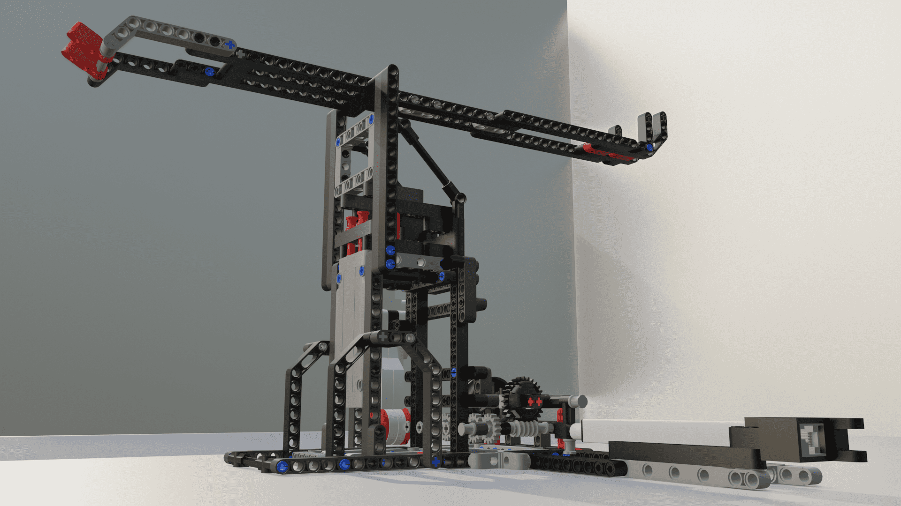
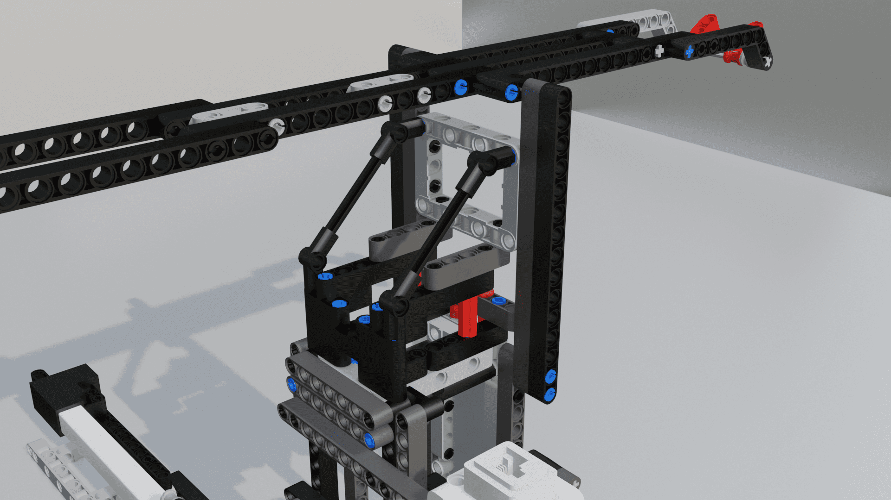
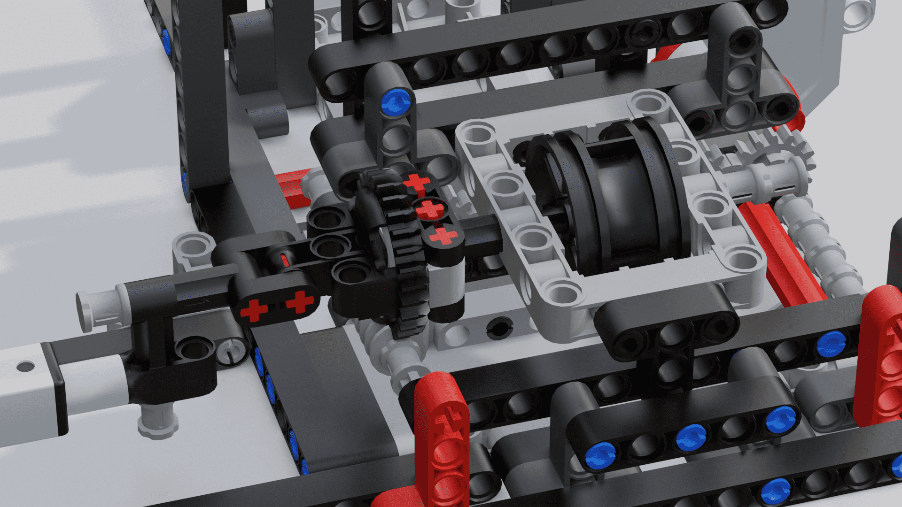
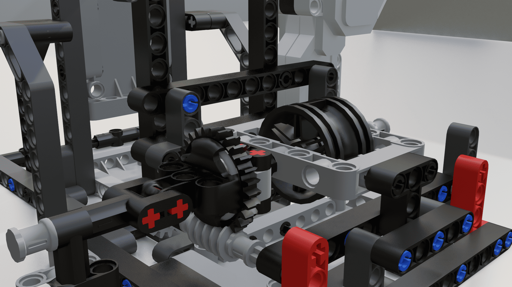
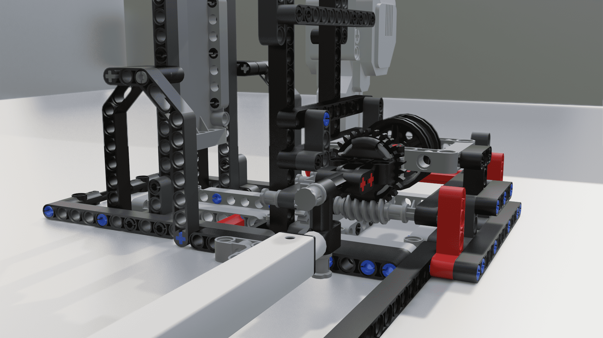

# Mindstorms Catapult
### A very strong and robust design for a fully automatic LEGO catapult


_Note: A high resolution version of the GIF is available in the renders directory._

__Many thanks to [Marcus Lenander](https://github.com/MarcusLenander) for helping create the design!__

### Setting up

##### Building

The file `catapult.mpd` contains a 3D model created in [LeoCAD](http://leocad.org). Open it using LeoCAD and use it as a reference when building. One can also open one of either `catapult.3ds` or `catapult.dae` as a reference.

After the catapult has been built, 6-8 rubber bands or springs can be added to make the catapult function. A string between the base wheel and the arm also needs to be attached.

##### Programming

An example class built around the catapult can be found in `catapult.py`. This class assumes that an EV3 brick running the official micropython runtime is used to power the catapult.

```Python
from pybricks.parameters import (SoundFile, Color, Port)

from catapult import Catapult

catapult = Catapult(Port.A, Port.B)
catapult.reset()

catapult.safe_lock()
catapult.retract(100)
catapult.unlock()
```

Note that the catapult arm is very strong and may damage itself if used incorrectly. Read through the provided class and always be ready to stop the execution of the program.

### Renders











### Contributing

Any contribution is welcome. If you're not able to code it yourself, perhaps someone else is - so post an issue if there's anything on your mind.

### Disclaimer

_Although the project is very capable, it is not built with production in mind. Therefore there might be complications when trying to use the catapult for large-scale projects meant for the public. The project was created to easily throw projectiles in a strong and automated way and as such it might not promote best practices nor be performant._
